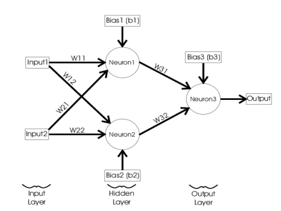
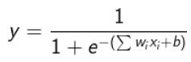

中文:

    專題目標：
        以粒子群演算法( PSO)與基因演算法(GA)找出類經網路(ANN)結構中的最佳
        化權重組合，解決 2 輸入的 XOR 問題
    
    理論說明：
        XOR 的真值表如下所示：
            X1 X2 Y
            0  0  0
            0  1  1
            1  0  1
            1  1  0

        類神經網路的目標是依據真值表對輸入模式進行分類。類神經網路需要使用
        隱藏層產生兩個不同的決策平面，根據輸出模式線性分離輸入資料。類神經網路
        將由一個具有兩個節點（X1，X2）的輸入層組成；一個隱藏層有兩個節點（因為
        需要兩個決策平面）；以及一個具有一個節點 (Y) 的輸出層。類神經網路結構如
        下：
            

        神經元作為類神經網路中的資訊處理單元，其特徵為：
        1. 類神經網路的資訊儲存在神經元之間的互連中，即權重。神經元的輸入值
           為前一層神經元輸出的加權和，Σwi xi
        2. 神經元的激勵函數為 sigmoid 函數，也稱為邏輯迴歸函數，其輸出值介於
           0 和 1 之間。
        3. 神經元的輸出 y 與輸入間的關係如下:
           

        神經網路透過根據學習演算法更新其權重來進行學習，從而幫助其收斂到預期
        輸出。學習演算法是基於損失函數改變權重和偏差的原則方法。損失函數(誤差)
        可以簡單地定義為預測結果與實際結果之間的差異，數學是如下：Error = 1/2 (t - y)^2

        專題說明：
            基於 XOR 真值表和類神經網路結構圖，使用粒子群演算法(Particle Swarm
            Optimization, PSO)和基因演算法(Genetic Algorithm, GA)找出神經網路最佳的權重
            組合，取代基於損失函數改變權重和偏差的方法。

English(英文):

    Project Objective:
        The goal of this project is to use Particle Swarm Optimization (PSO) and Genetic Algorithm (GA) to find the optimal weight combination in an Artificial Neural Network (ANN) structure to solve the 2-input XOR problem.

    Theoretical Explanation:
        The truth table for the XOR function is as follows:
            X1	X2	Y
            0	0	0
            0	1	1
            1	0	1
            1	1	0
        The goal of the artificial neural network is to classify the input patterns based on the truth table. The ANN needs to use a hidden layer to generate two distinct decision planes to linearly separate the input data according to the output patterns.

        The ANN consists of:
            An input layer with two nodes (X1, X2)
            A hidden layer with two nodes (since two decision planes are needed)
            An output layer with one node (Y)
            The structure of the ANN is shown below:
            

        Neurons in Artificial Neural Networks:
        Neurons serve as the fundamental processing units in an ANN, with the following characteristics:
            Information in an ANN is stored in the interconnections between neurons, represented by weights. The input to a neuron is the weighted sum of the outputs from the previous layer, calculated as Σwi xi.
            The activation function of a neuron is the sigmoid function, also known as the logistic regression function, which outputs values between 0 and 1.
        The relationship between the neuron’s output y and input is as follows:
            

        Neural networks learn by updating their weights based on a learning algorithm, helping them converge to the expected output. The learning algorithm follows the principle of modifying weights and biases based on a loss function. The loss function (error) is defined as the difference between the predicted and actual results, mathematically expressed as:Error = 1/2 (t - y)^2
    
        Project Description:
            Based on the XOR truth table and the ANN structure, this project will use Particle Swarm Optimization (PSO) and Genetic Algorithm (GA) to find the optimal weight combination for the neural network. This approach replaces the traditional method of updating weights and biases based on the loss function.